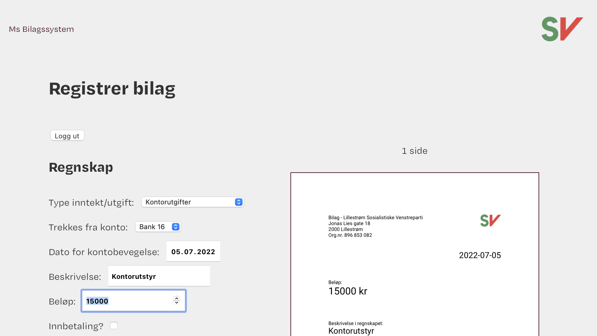

<!-- AUTO-GENERATED-CONTENT:START (STARTER) -->

    
  </a>

<h1 align="center">
  mRegnskap
</h1>

Simplified accounting in Google Sheets and Drive through this one-stop portal for registration, classification and encryption of accounting documents.

## Features

- Authentication and integration with the **Google API**. Fetches and updates sheet data, and uploads encrypted documentation to Google Drive.
- **Serverless** - compiles and deploys to Gatsby Cloud. API features using Lambda functions.
- **PDF-generation** - PDFs are client-driven and browser-centered. Generated in the cloud with a web worker.
- **Flexible support for attachments** - attachments may provided by claimants as JPEGs, scanned PDFs, text in e-mails and as multi-page PDF invoices. This system handles them all.
- **Secure** - the PDF may be password protected before being uploaded to Google Drive.